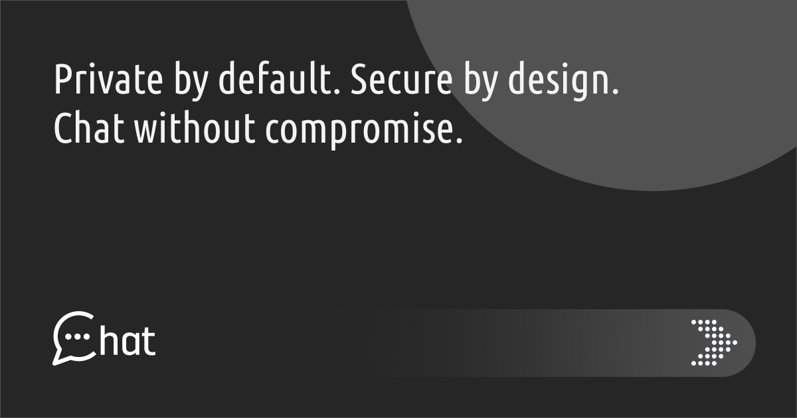

<p align="center">
  
</p>

<h1 align="center">MyChat</h1>

<p align="center">
  A secure, encrypted chat application built for private conversations and contact management.
  <br />
  <a href="https://github.com/valasme/my-chat"><strong>View on GitHub</strong></a>
</p>

<p align="center">
  
  
  
  
  
  
</p>

---

## About

MyChat is a full-stack chat application where users can add contacts, exchange encrypted messages, and manage their relationships through blocking, ignoring, and soft-deleting contacts. Built on the Laravel Livewire starter kit with Fortify authentication, it provides a complete messaging experience with privacy at its core.

---

## Features

- **Encrypted messaging** -- all message bodies are encrypted at rest using Laravel's built-in encryption
- **Contact system** -- send, accept, and decline contact requests between users
- **One-to-one conversations** -- automatically created when a contact request is accepted
- **User blocking** -- block users to sever all connections, deleting conversations and messages
- **Temporary ignoring** -- mute a user for a configurable duration (1 hour to 7 days, or custom)
- **Soft-delete (trash)** -- move contacts to trash with an expiration period before permanent deletion
- **Quick delete** -- instantly erase all messages in a conversation and schedule contact removal
- **Two-factor authentication** -- TOTP-based 2FA with recovery codes via Laravel Fortify
- **Email verification** -- users must verify their email before accessing protected settings
- **Password reset** -- full forgot/reset password flow
- **Dashboard overview** -- at-a-glance stats, recent conversations, pending requests, and expiring items
- **Alphabetical sorting** -- all list views support A-Z and Z-A sorting with query string persistence
- **Pagination** -- all list views are paginated (15 per page, messages at 50 per page)
- **Rate limiting** -- separate rate limits for reads (120/min), writes (30/min), and messages (60/min)
- **Scheduled cleanup** -- expired ignores and trashes are automatically pruned every 15 minutes
- **Policy-based authorization** -- every action is gated through dedicated policy classes
- **Dark theme** -- ships with a refined dark UI built on Tailwind CSS 4

---

## Tech Stack

| Layer          | Technology                                                          |
| -------------- | ------------------------------------------------------------------- |
| Framework      | [Laravel 13](https://laravel.com)                                   |
| Frontend       | [Livewire 4](https://livewire.laravel.com) + [Flux UI 2](https://fluxui.dev) |
| Styling        | [Tailwind CSS 4](https://tailwindcss.com)                           |
| Authentication | [Laravel Fortify](https://laravel.com/docs/fortify) (2FA, email verification, password reset) |
| Build Tool     | [Vite 8](https://vitejs.dev) with the Laravel Vite Plugin           |
| Database       | SQLite (default), configurable to MySQL/PostgreSQL                   |
| Testing        | [PHPUnit 12](https://phpunit.de)                                    |
| Code Style     | [Laravel Pint](https://laravel.com/docs/pint) (Laravel preset)      |
| CI/CD          | GitHub Actions (tests + linting on push/PR)                          |
| Runtime        | PHP 8.4                                                              |

---

## Architecture

```
app/
  Actions/Fortify/       # User creation and password reset actions
  Concerns/              # Shared validation rule traits
  Console/Commands/      # Scheduled cleanup commands
  Http/
    Controllers/         # Resource controllers for all entities
    Requests/            # Form request validation classes
  Livewire/Actions/      # Livewire action classes (logout)
  Models/                # Eloquent models with scopes and relationships
  Policies/              # Authorization policies for every model
  Providers/             # App and Fortify service providers

database/
  factories/             # Model factories for all entities
  migrations/            # Schema definitions with performance indexes
  seeders/               # Seeder classes for development data

resources/
  views/
    blocks/              # Block list management
    components/          # Reusable Blade components
    contacts/            # Contact CRUD views
    conversations/       # Conversation list and message thread
    ignores/             # Ignore list management
    layouts/             # App, auth, sidebar, and header layouts
    pages/auth/          # Fortify authentication views
    pages/settings/      # Profile, security, and appearance (Livewire SFC)
    trashes/             # Trash list management

routes/
  web.php               # Main application routes
  settings.php          # Settings routes (Livewire pages)
  console.php           # Scheduled command registration
```

---

## Data Model

```
User
  |-- sentContactRequests    --> Contact (user_id)
  |-- receivedContactRequests --> Contact (contact_user_id)
  |-- blocks                 --> Block (blocker_id)
  |-- blockedBy              --> Block (blocked_id)
  |-- ignores                --> Ignore (ignorer_id)
  |-- ignoredBy              --> Ignore (ignored_id)

Contact [user_id, contact_user_id, status: pending|accepted]
  |-- user                   --> User
  |-- contactUser            --> User

Conversation [user_one_id, user_two_id]  (lower ID always first)
  |-- userOne                --> User
  |-- userTwo                --> User
  |-- messages               --> Message[]

Message [conversation_id, sender_id, body (encrypted)]
  |-- conversation           --> Conversation
  |-- sender                 --> User

Block [blocker_id, blocked_id]
Ignore [ignorer_id, ignored_id, expires_at]
Trash [user_id, contact_id, expires_at, is_quick_delete]
```

---

## Getting Started

### Prerequisites

- PHP 8.4+
- Composer
- Node.js 22+
- npm

### Installation

```bash
git clone https://github.com/valasme/my-chat.git
cd my-chat
composer setup
```

The `composer setup` script handles everything: installing PHP and Node dependencies, copying the environment file, generating the application key, running migrations, and building frontend assets.

### Development Server

```bash
composer run dev
```

This starts four processes concurrently:

| Process       | Description                    |
| ------------- | ------------------------------ |
| `php artisan serve`         | Application server  |
| `php artisan queue:listen`  | Queue worker        |
| `php artisan pail`          | Real-time log viewer|
| `npm run dev`               | Vite dev server     |

The application will be available at `http://localhost:8000`.

### Seeding

```bash
php artisan db:seed
```

Creates a test user (`test@example.com`) along with 50 additional users, contacts, conversations, messages, blocks, ignores, and trash records for development.

---

## Configuration

### Environment Variables

Copy `.env.example` to `.env` and adjust as needed:

| Variable          | Default     | Description                          |
| ----------------- | ----------- | ------------------------------------ |
| `APP_NAME`        | `MyChat`    | Application display name             |
| `DB_CONNECTION`   | `sqlite`    | Database driver                      |
| `SESSION_DRIVER`  | `database`  | Session storage backend              |
| `QUEUE_CONNECTION`| `database`  | Queue driver                         |
| `CACHE_STORE`     | `database`  | Cache backend                        |
| `BCRYPT_ROUNDS`   | `12`        | Password hashing cost factor         |
| `MAIL_MAILER`     | `log`       | Mail driver (set to `smtp` for production) |

### Fortify Features

Enabled in `config/fortify.php`:

- User registration
- Password reset
- Email verification
- Two-factor authentication (with password confirmation)

### Rate Limits

Configured in `AppServiceProvider`:

| Limiter          | Limit       | Applies To                              |
| ---------------- | ----------- | --------------------------------------- |
| `chat-read`      | 120/min     | Listing contacts, conversations, blocks |
| `chat-write`     | 30/min      | Creating/updating/deleting resources    |
| `chat-message`   | 60/min      | Sending messages                        |
| `login`          | 5/min       | Authentication attempts                 |
| `two-factor`     | 5/min       | 2FA challenge attempts                  |

### Password Policy (Production)

In production, passwords must meet all of the following:

- Minimum 12 characters
- Mixed case letters
- At least one number
- At least one symbol
- Not found in known breach databases

---

## Testing

```bash
# Run all tests
php artisan test --compact

# Run a specific test file
php artisan test --compact tests/Feature/ConversationTest.php

# Run a specific test method
php artisan test --compact --filter=testName
```

### Test Coverage

| Area                     | Test File                              |
| ------------------------ | -------------------------------------- |
| Authentication           | `tests/Feature/Auth/AuthenticationTest.php` |
| Registration             | `tests/Feature/Auth/RegistrationTest.php` |
| Email Verification       | `tests/Feature/Auth/EmailVerificationTest.php` |
| Password Reset           | `tests/Feature/Auth/PasswordResetTest.php` |
| Password Confirmation    | `tests/Feature/Auth/PasswordConfirmationTest.php` |
| Two-Factor Auth          | `tests/Feature/Auth/TwoFactorChallengeTest.php` |
| Contacts                 | `tests/Feature/ContactTest.php`        |
| Conversations            | `tests/Feature/ConversationTest.php`   |
| Messages                 | `tests/Feature/MessageTest.php`        |
| Blocks                   | `tests/Feature/BlockTest.php`          |
| Ignores                  | `tests/Feature/IgnoreTest.php`         |
| Trash                    | `tests/Feature/TrashTest.php`          |
| Dashboard                | `tests/Feature/DashboardTest.php`      |
| Rate Limiting            | `tests/Feature/RateLimitTest.php`      |
| Expired Ignore Cleanup   | `tests/Feature/CleanExpiredIgnoresTest.php` |
| Expired Trash Cleanup    | `tests/Feature/CleanExpiredTrashesTest.php` |
| Integration (End-to-End) | `tests/Feature/IntegrationTest.php`    |
| Profile Settings         | `tests/Feature/Settings/ProfileUpdateTest.php` |
| Security Settings        | `tests/Feature/Settings/SecurityTest.php` |

---

## Linting

```bash
# Fix code style
composer lint

# Check without fixing
composer lint:check
```

Uses Laravel Pint with the `laravel` preset. The CI pipeline runs lint checks automatically on every push and pull request.

---

## Scheduled Commands

| Command                        | Frequency       | Description                                    |
| ------------------------------ | --------------- | ---------------------------------------------- |
| `app:clean-expired-ignores`    | Every 15 min    | Deletes expired ignore records                 |
| `app:clean-expired-trashes`    | Every 15 min    | Processes expired trash -- permanently removes contacts and conversations |

Both commands run with `withoutOverlapping()` and `onOneServer()` for safe multi-instance deployments.

---

## CI/CD

GitHub Actions workflows run on every push and pull request to `main`, `develop`, `master`, and `workos` branches:

**Tests** (`tests.yml`) -- sets up PHP 8.4, Node 22, installs dependencies, builds assets, and runs the full PHPUnit suite.

**Linter** (`lint.yml`) -- runs Laravel Pint to verify code style compliance.

---

## Deployment

This application can be deployed using [Laravel Cloud](https://cloud.laravel.com/) for the fastest path to production, or any hosting environment that supports PHP 8.4+ with a compatible database.

---

## Community

- [Code of Conduct](CODE_OF_CONDUCT.md)
- [Security Policy](SECURITY.md)

This project does not accept pull requests or direct contributions. You are welcome to fork or clone the repository and make it your own.

---

## License

MIT License -- Copyright (c) 2026 Dimitris Valasellis. See the [LICENSE](LICENSE) file for details.
